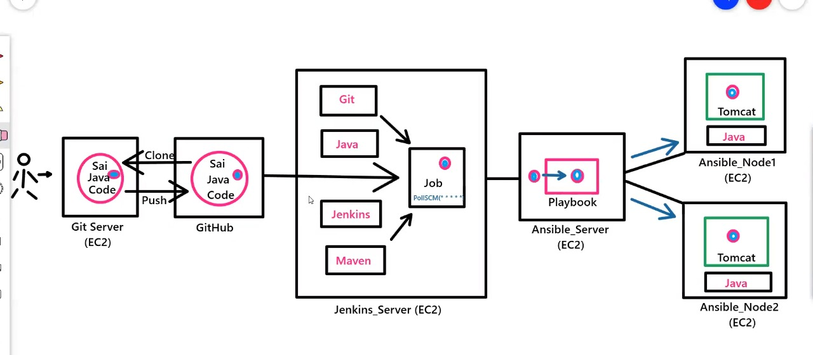
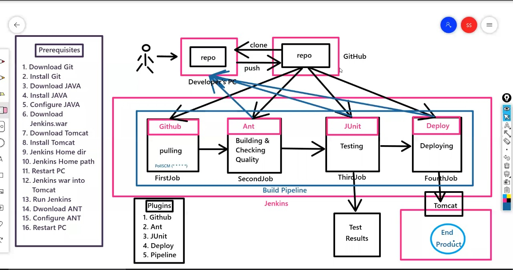

# Devops
`Jenkins, Git, BashScripting, Terraform, Docker, Ansible, Kubernetes`
# AmazonWebServices
`EC2, EBS, EFS, S3, IAM, ASG, LB/ELB, VPC, R53, EC, SNS, SNS, Cloudfront, RDS, DynamoDB, Lambda, Cloud Watch, Cloud Formation`
# Projects
 
1. Project - an hello world code to be build with java
1. Project - with Jenkins to publish over container to host server
1. Project - with Docker 
1. Project - with Ansible
1. Project - with Kubernetes
1. Project - Build jenkins jobs for
    - java using tomcat
    - .net using .netCore SDK
    - to serve a angular application
    - create a DB

[] <br><br>
[] <br><br>
[] <br><br>

## Project - an hello world code to be build with java via jenkins    
  - Install git `yum install git -y`  
  - Install Jenkins, choose redhat: https://pkg.jenkins.io/redhat-stable/
  - Install Maven, choose bin : https://maven.apache.org/install.html    
  - Configure Java and maven:
      ```
          > find / -name jvm
          > cd /usr/lib/jvm
          > ls
          > find / -name java-11*
          > vi ~/.bash_profile
              M2_HOME=/opt/maven
              M2=/opt/maven/bin
              JAVA_HOME=java-11-openjdk-11.0.13.0.8-1.amzn2.0.3.x86_64
              PATH=$PATH:$HOME/bin:$JAVA_HOME:$M2_HOME:$M2
      ```
  - Under ManagePlugin, install the below mentioned plugins
      - GitHub | Maven Integration | Deploy to container | Publish over SSH
  - Under Global Tool Configuration> set folder path of java, git, maven
  - Create build job for java app, required command `clean package` or `clean install` 
  - **Verify** the workspace and check webapp.war under target folder> `cd /var/lib/jenkins/workspace`
  * (X) Java : https://thenucleargeeks.com/2019/12/12/install-java-on-aws-ec2-instance/
  * (X) Jenkins:  https://www.jenkins.io/doc/tutorials/tutorial-for-installing-jenkins-on-AWS/ 

## Project - with Jenkins to publish over container to tomcat host server
  - Install java from amazon-extras-linux, `amazon-linux-extras install java-openjdk11 -y`
  - Install tomcat server, choose core : https://tomcat.apache.org/download-90.cgi
  - To allow public access change and user login under conf> 
      - files of host-manager dir | manger dir `find / -name context.xml`,  comment out > allow 127 section
      - tomcat-users.xml file, add manager-gui and manager-script roler and admin user
  - Now under bin dir do> `./shutdown.sh and ./startup.sh`
  - In jenkins under Manage Credential > Jenkins > Global credentials > Add Credentials of **admin** which we mentioned in tomcat-sers.xml
  - In jenkins create a new build job under post build action choose> **Deploy war/ear to a container** and provide the tomcat instance ip url.
--------------------------
Jenkins should need access to the tomcat server to deploy build artifacts. setup credentials to enable this process. use credentials option on Jenkins home page.

- setup credentials
  - `credentials` > `jenkins` > `Global credentials` > `add credentials`
    - Username	: `deployer`
    - Password : `deployer`
    - id      :  `deployer`
    - Description: `user to deploy on tomcat vm`

   - *Post-build Actions*
   - Deploy war/ear to container
      - WAR/EAR files : `**/*.war`
      - Containers : `Tomcat 8.x`
         - Credentials: `deployer` (user created on above)
         - Tomcat URL : `http://<PUBLIC_IP>:8080`
--------------------------
  - **Verify** in tomcat instance for webapp.war file, under /opt/tomcat/webapps. Now open the url to check java app.
  - (X) https://devops4solutions.com/installation-of-tomcat-on-aws-ec2-linux-integration-with-jenkins/

## Project - with Docker  
*Jenkins Job name:* `Deploy_on_Tomcat_Server`
  - https://forums.docker.com/t/tomcat-give-error-404/95130/2


URLS:

1.	https://thenucleargeeks.com/2019/12/12/install-java-on-aws-ec2-instance/
2.	https://maven.apache.org/install.html
3.	https://www.jenkins.io/doc/book/installing/linux/
4.	https://blog.cloudthat.com/how-to-install-ansible-on-rhel-8/
5.	https://devops4solutions.com/installation-of-tomcat-on-aws-ec2-linux-integration-with-jenkins/
6.	https://nozaki.me/roller/kyle/entry/articles-jenkins-sshdeploy
7.	https://linuxtechlab.com/how-to-easily-add-ssh-credentials-on-jenkins-server/
8.	
9.	https://www.tecmint.com/run-sudo-command-without-password-linux/
10.	https://www.e2enetworks.com/help/knowledge-base/how-to-enable-disable-password-based-authentication-for-ssh-access-to-server/
11.	https://docs.ansible.com/ansible/latest/user_guide/intro_inventory.html#intro-inventory
12.	Permanent bashrc: https://stackoverflow.com/a/38094841
13.	Copy Git File:  https://stackoverflow.com/a/65446645
14.	https://stackoverflow.com/questions/24588742/java-8-application-on-ec2
1. https://www.hireitpeople.com/


URLS:

1.	https://nozaki.me/roller/kyle/entry/articles-jenkins-sshdeploy
2.	https://linuxtechlab.com/how-to-easily-add-ssh-credentials-on-jenkins-server/
3.	
4.	https://www.tecmint.com/run-sudo-command-without-password-linux/
5.	https://www.e2enetworks.com/help/knowledge-base/how-to-enable-disable-password-based-authentication-for-ssh-access-to-server/
6.	https://docs.ansible.com/ansible/latest/user_guide/intro_inventory.html#intro-inventory
7.	Permanent bashrc: https://stackoverflow.com/a/38094841
8.	Copy Git File:  https://stackoverflow.com/a/65446645
9.	https://stackoverflow.com/questions/24588742/java-8-application-on-ec2


<br>
<br>
<br>
<br>
<br>
<br>
<br>
<br>
<br>
<br>
<br>
<br>
<br>
<br>
<br>
<br>
<br>
<br>
<br>
<br>
<br>
<br>
<br>
<br>
<br>


Format:
# Create a First Maven Jenkins job to build hello-world project 
# *Jenkins Job name:* `My_First_Maven_Build`

We know how to use work with each and Git, Jenkins independently. What if you want to collaborate these two? that is where Simple DevOps project helps you. Follow the below steps if you are a new guy to DevOps. You love it. 


#### Pre-requisites

1. Jenkins server 


### Steps to create "My_First_Maven_Build" Jenkin job
1. Login to Jenkins console
1. Create *Jenkins job*, Fill the following details,
   - *Source Code Management:*
      - Repository: `https://github.com/yankils/hello-world.git`
      - Branches to build : `*/master`  
   - *Build:*
     - Root POM:`pom.xml`
     - Goals and options: `clean install package`